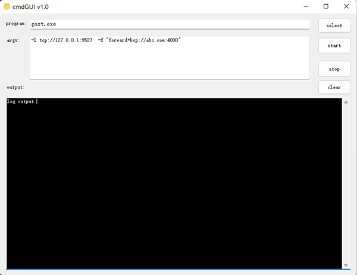

# gostGUI
A gui tool to run terminal program(for example gost.exe) on Windows.  
No need to install the program as service.   
Just  run silently at background.

### Feature

- select .exe file support drag and drop.
- args config can be saved and restore at next startup.
- trayIcon no show on taskbar.

### Screen

### How to use
- place the .exe file with gostGUI
- select program and type args in textbox
- press start button.  

