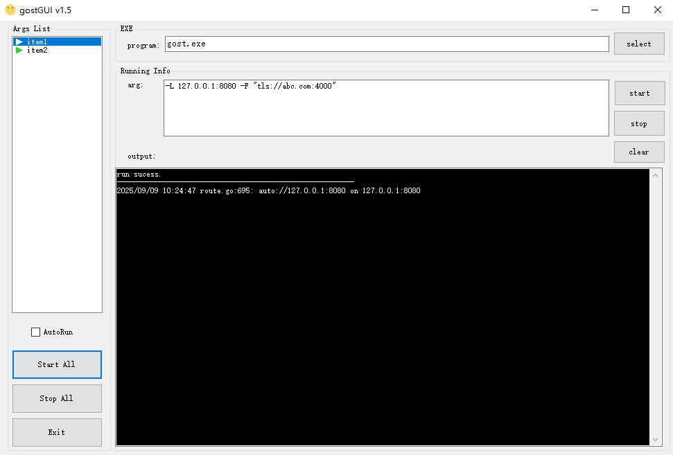

# gostGUI
A gui tool to run terminal program(for example gost.exe) on Windows.  
No need to install the program as service.   
Just  run silently in the background.

### Feature
- **Multi-Process Management**: Run and manage several command-line applications simultaneously, each with its own configuration.
- **Persistent Configurations**: All configurations are saved to a `config.json` file and reloaded on startup.
  - Add, delete, and rename configurations on-the-fly.
  - Easily edit program paths and arguments.
- **Process Control**:
  - Start and Stop individual processes.
  - Start All / Stop All enabled processes with a single click.
  - The `Enable` flag in the configuration determines if a process is included in "Start All" operations.
- **Robust Operation**:
  - Child processes run silently in the background without a visible console window.
  - **Automatic Cleanup**: All managed child processes are automatically terminated when gostGUI exits, even if it crashes, preventing orphaned processes.
- **User-Friendly Interface**:
  - **System Tray Integration**: Minimizes to the system tray to stay out of your way. Includes a tray icon context menu for quick access to major functions (Start All, Stop All, Exit).
  - **Live Status Indicators**: A visual icon in the list (▶ for running, ■ for stopped) shows the current state of each process, with colors that adapt to selection for clarity.
  - **Per-Process Logging**: View real-time console output for each application in its own dedicated log window, which includes startup, shutdown, and exit code information.
  - **Easy Configuration**: Supports drag-and-drop for setting the executable file path.
- **Windows Integration**:
  - Option to automatically start with Windows.
  

### Screen

### How to use
- place the .exe file with gostGUI.exe
- select program and type args in textbox
- press start button.  

### Configuration (`config.json`)

`gostGUI` saves its settings in a `config.json` file in the same directory.
- `Name`: The unique name for the configuration.
- `Program`: The path to the executable.
- `Args`: The command-line arguments.
- `Enable`: A boolean (`true`/`false`) that determines if this configuration is started by "Start All". This is automatically updated when you start or stop a process.

### Change log
- **v1.5**: Implemented robust multi-process management and automatic child-process cleanup on exit. Revamped UI with custom-drawn status icons and improved in-place editing. (Thanks to Gemini Code Assist).
- **v1.2**: Added "Run on system startup" functionality.
- **v0.1**: Initial release with support for multiple argument configurations.

